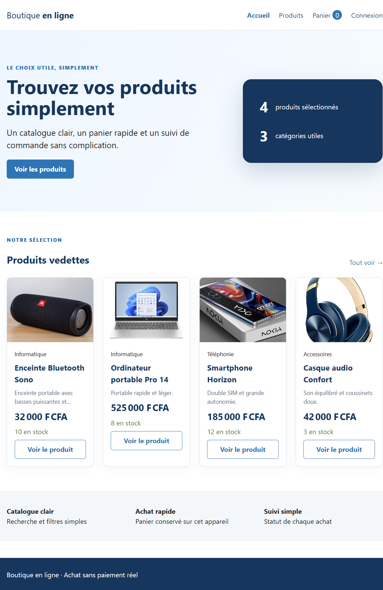
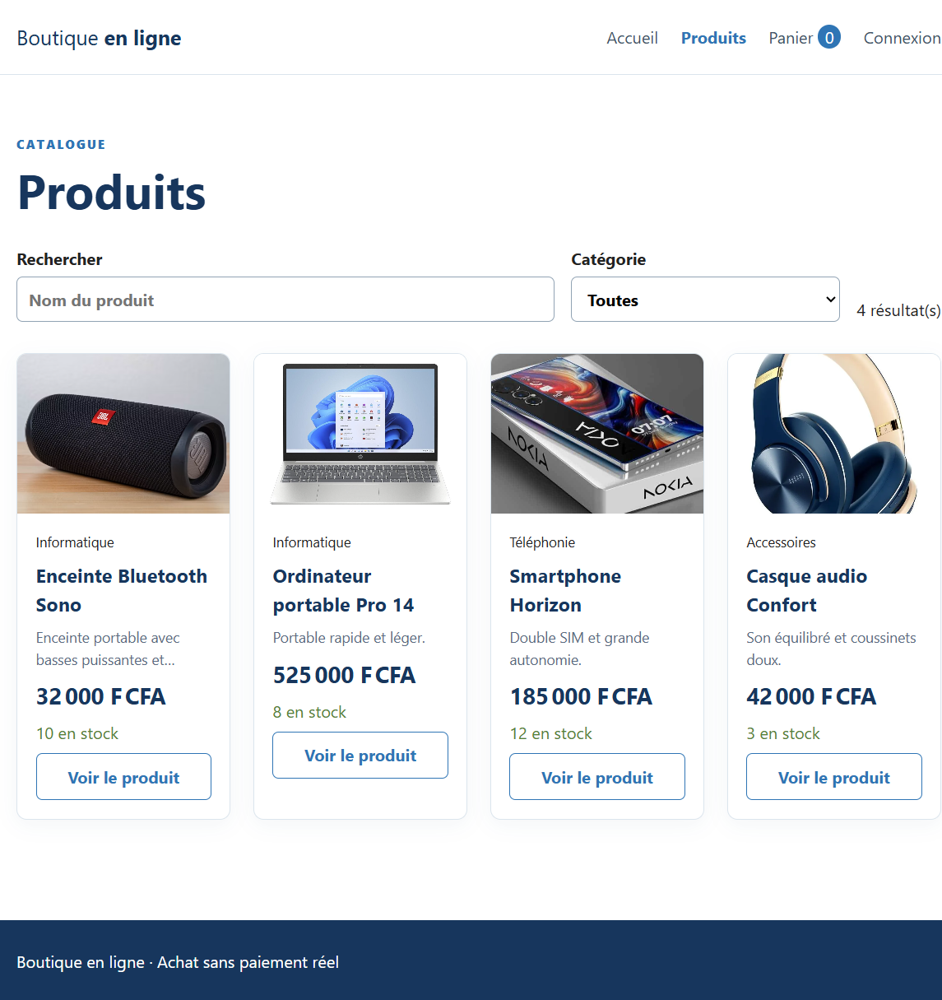
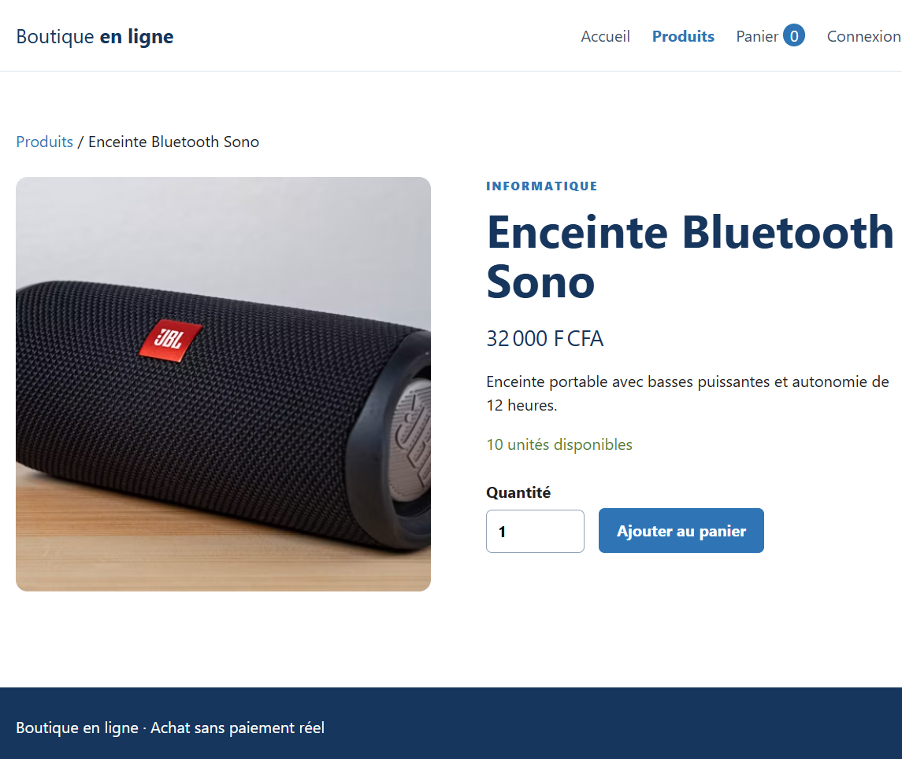
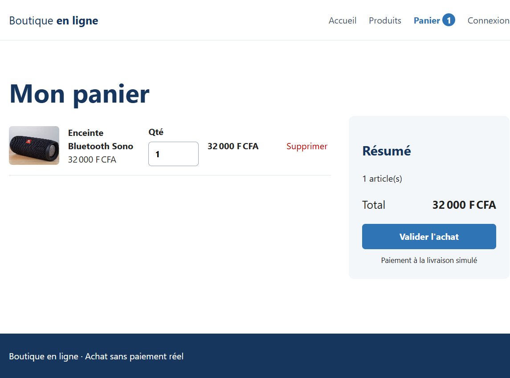
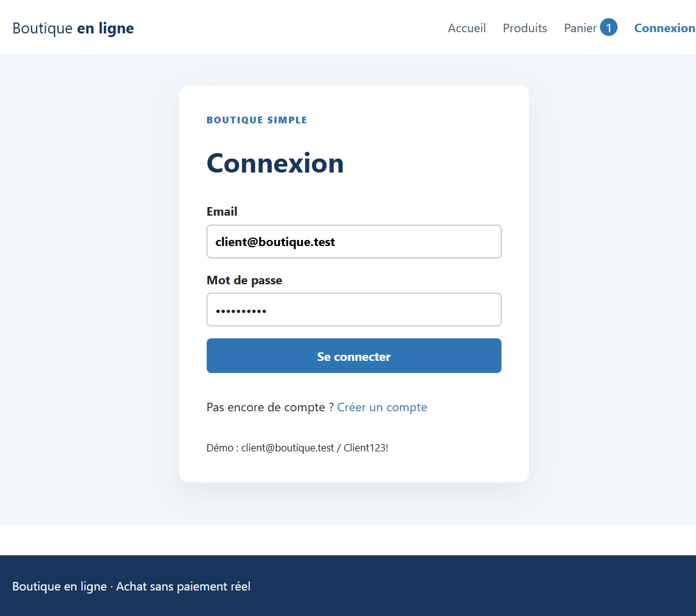
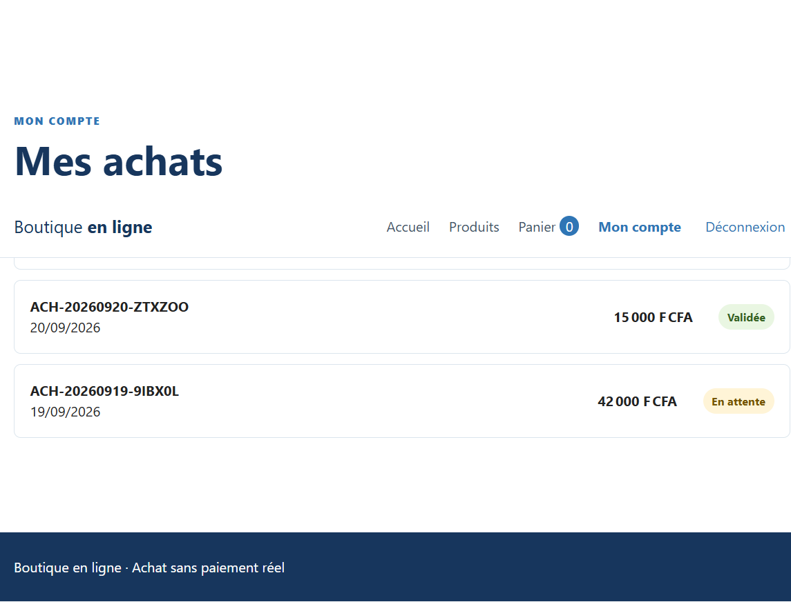
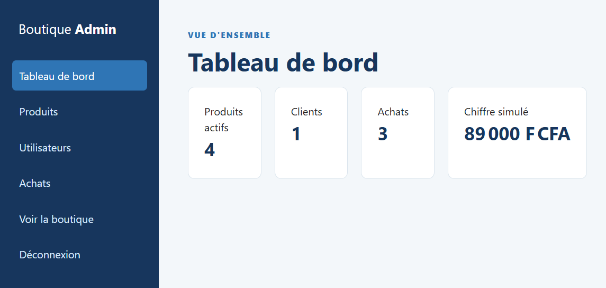
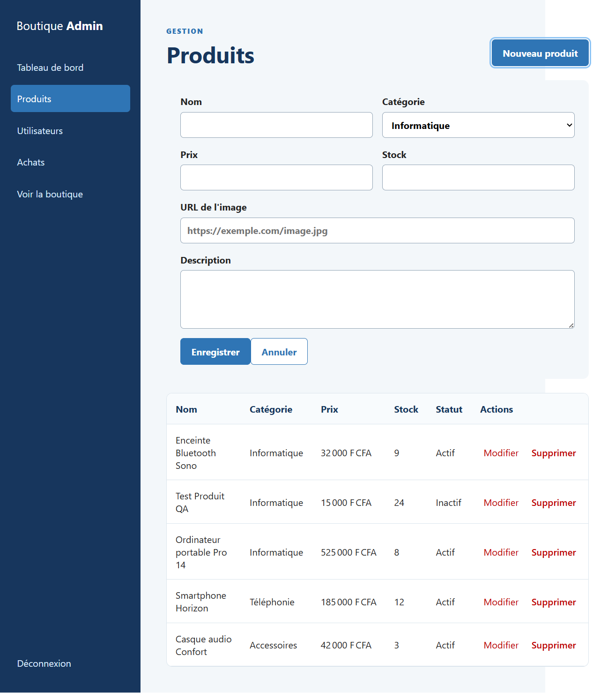
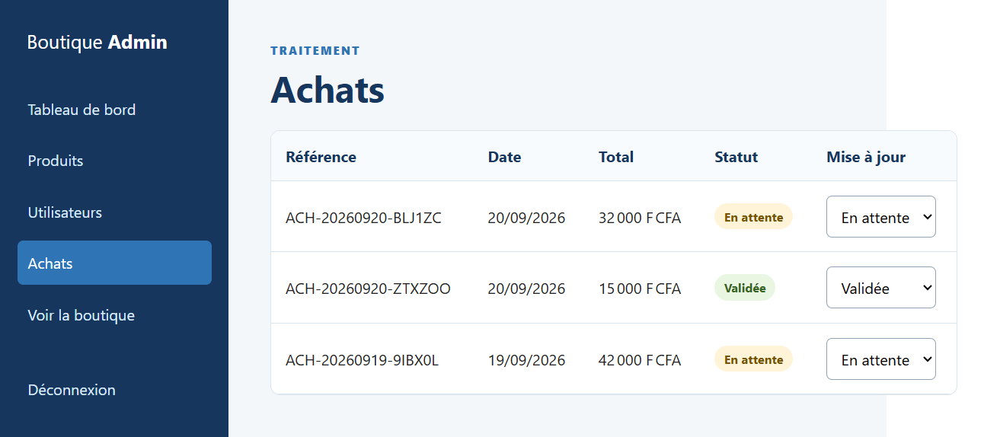
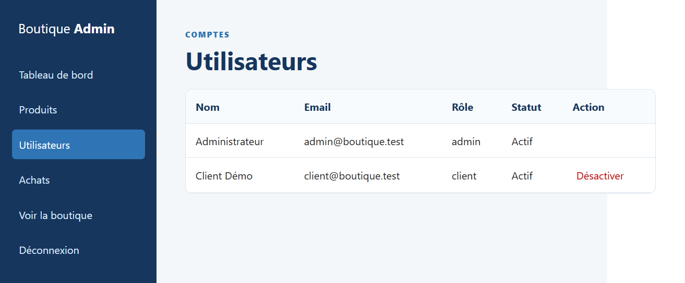

# Boutique en ligne — Présentation de l'application

## En résumé

Boutique en ligne est une petite application e-commerce composée de deux briques séparées :

- un **frontend** en React 19 + Vite qui gère l'affichage du catalogue, le panier, l'authentification et l'espace d'administration ;
- un **backend** en Laravel 12 qui expose une API REST (`/api/v1`), gère la base de données MySQL, l'authentification par tokens Sanctum et toute la logique métier (stock, achats, rôles).

Deux profils peuvent utiliser l'application : le **client**, qui parcourt le catalogue et passe des achats, et l'**administrateur**, qui gère les produits, les utilisateurs et le traitement des commandes.

## Parcours client

Un visiteur arrive sur la page d'accueil, qui met en avant une sélection de produits vedettes tirée directement du catalogue réel.

Depuis là, il peut consulter le catalogue complet, filtrer par nom ou par catégorie. Chaque fiche produit affiche désormais son image et sa description, en plus du prix et du stock disponible.

En cliquant sur un produit, on accède à sa fiche détaillée avec la possibilité de choisir une quantité et de l'ajouter au panier.

Le panier récapitule les articles sélectionnés, avec un total recalculé automatiquement.

Pour valider un achat, une connexion est nécessaire. Un compte de démonstration est fourni (`client@boutique.test` / `Client123!`).

Une fois l'achat validé, le client retrouve l'historique de ses commandes avec leur statut (en attente, validée, expédiée, annulée).

## Espace administrateur

L'administrateur (`admin@boutique.test` / `Admin123!`) dispose d'un tableau de bord qui résume l'activité de la boutique : nombre de produits actifs, de clients, d'achats et chiffre d'affaires simulé.

Il peut créer, modifier et supprimer des produits, avec un champ dédié pour renseigner l'URL de l'image et la description.

Il suit également les achats de tous les clients et peut faire évoluer leur statut au fil du traitement de la commande.

Enfin, il gère les comptes utilisateurs et peut désactiver un client si nécessaire (le compte administrateur reste protégé).

## Les tests que j'ai effectués

Avant de considérer l'application comme fonctionnelle, j'ai fait passer plusieurs scénarios réels à travers les deux profils, directement dans le navigateur et sur la base de données du projet.

**Création et affichage d'un produit.** Je me suis connecté en tant qu'admin, j'ai créé un produit ("Test Produit QA" puis "Enceinte Bluetooth Sono" avec une image), puis je suis allé vérifier côté client que ce produit apparaissait bien dans le catalogue public et sur sa fiche détaillée. La première fois, ça ne marchait pas : le catalogue public utilisait encore des données factices codées en dur dans le frontend au lieu d'interroger l'API. J'ai corrigé ce point pour que la page d'accueil, le catalogue et la fiche produit récupèrent réellement les produits depuis la base de données.

**Achat en tant que client.** J'ai ajouté un produit au panier, je me suis connecté avec le compte client, et j'ai validé l'achat. J'ai vérifié directement en base de données que la commande était bien enregistrée avec le bon total et le bon stock décrémenté. Là aussi, un problème est apparu : la page "Mes achats" et le tableau de bord admin lisaient encore les commandes depuis le stockage local du navigateur au lieu de les récupérer depuis l'API. Une fois corrigé, l'achat apparaissait correctement des deux côtés.

**Suivi et changement de statut d'un achat côté admin.** J'ai changé le statut d'une commande ("En attente" → "Validée") depuis l'interface admin et vérifié que la mise à jour était bien répercutée en base et visible côté client dans son historique.

**Modification et suppression de produits.** Il n'y avait initialement aucun moyen de supprimer un produit depuis l'interface. Je l'ai ajouté, avec une confirmation avant suppression. J'ai testé deux cas : la suppression d'un produit jamais acheté (il disparaît complètement), et la suppression d'un produit déjà lié à un achat (dans ce cas le backend le désactive au lieu de le supprimer, pour ne pas casser l'historique des commandes — et j'ai vérifié que le message d'information s'affichait bien et que le produit disparaissait du catalogue public tout en restant visible comme "Inactif" côté admin).

**Séparation des rôles.** Je me suis assuré qu'un client ne voit jamais le lien "Administration" dans le menu et qu'un compte non-admin ne peut pas accéder aux routes d'administration de l'API (déjà couvert par un test automatisé côté backend).

**Suite de tests automatisés backend.** En creusant, j'ai aussi trouvé que `php artisan test` ne fonctionnait pas du tout à cause d'une configuration Composer incomplète (le namespace `Tests\` n'était pas déclaré). Une fois corrigé, les 5 tests automatisés du projet (autorisation admin, recalcul du total d'achat, gestion du stock) passent tous avec succès.

## En bref

L'application fonctionne de bout en bout pour les deux profils : un client peut parcourir le catalogue, acheter et suivre ses commandes ; un administrateur peut gérer les produits (avec image et description), suivre les achats et gérer les comptes. Les principaux bugs trouvés pendant les tests concernaient des pages qui utilisaient encore des données de démonstration statiques au lieu d'interroger l'API réelle — ils ont été corrigés et revérifiés manuellement après chaque correction.
